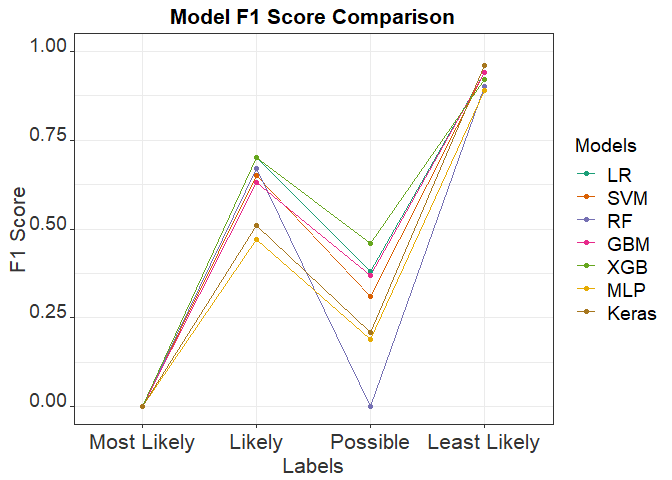

F1 score Plot
================
Hannah Nicholls
23 July 2019

R Markdown
----------

``` r
setwd("~/MRes/Blood pressure prediction/BP Gene Prediction/Plots")
library(ggplot2)
```

    ## Warning: package 'ggplot2' was built under R version 3.5.3

``` r
library(reshape2)
```

    ## Warning: package 'reshape2' was built under R version 3.5.3

``` r
f1score <- read.csv('f1score.csv')


#F1 score BP data:

f1score$F1score <- as.character(f1score$F1score)

f1score$F1score <- factor(f1score$F1score, levels=unique(f1score$F1score))

data.m <- melt(data = f1score, id.vars = "F1score", measure.vars =  c("LR","SVM","RF","GBM","XGB", "MLP","Keras"))
Models <- data.m$variable
plot <- ggplot(data.m, aes(F1score, value)) +
  geom_line(aes(colour = Models, group = Models)) + 
  geom_point(aes(colour = Models)) + theme_bw() +
  scale_y_continuous(limits = c(0, 1)) +
  theme(axis.text.x = element_text(color = "grey20", size = 16, hjust = .5, vjust = .5, face = "plain"),
        axis.text.y = element_text(color = "grey20", size = 14, angle = 0, hjust = 1, vjust = 0, face = "plain"),  
        axis.title.x = element_text(color = "grey20", size = 16, angle = 0, hjust = .5, vjust = 0, face = "plain"),
        axis.title.y = element_text(color = "grey20", size = 16, angle = 90, hjust = .5, vjust = .5, face = "plain"))+
  theme(plot.title = element_text(size = 16, face = "bold"),
        legend.title=element_text(size=14), legend.text=element_text(size=14))
p <- plot + ggtitle("Model F1 Score Comparison")  +
  xlab("Labels") + ylab("F1 Score") + theme(plot.title = element_text(hjust = 0.5))
```


