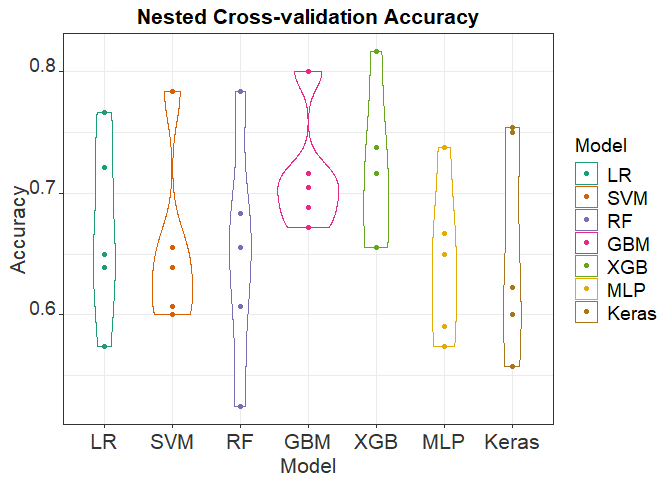

Nested-CV Violinplot
================
Hannah Nicholls
23 July 2019

R Markdown
----------

``` r
setwd("~/MRes/Blood pressure prediction/BP Gene Prediction/Plots")
library(ggplot2)
```

    ## Warning: package 'ggplot2' was built under R version 3.5.3

``` r
library(knitr)
```

    ## Warning: package 'knitr' was built under R version 3.5.3

``` r
library(tidyverse)
```

    ## Warning: package 'tidyverse' was built under R version 3.5.3

    ## -- Attaching packages ----------------------------------------------------------------------------------------------- tidyverse 1.2.1 --

    ## v tibble  2.1.1       v purrr   0.3.2  
    ## v tidyr   0.8.3       v dplyr   0.8.0.1
    ## v readr   1.3.1       v stringr 1.4.0  
    ## v tibble  2.1.1       v forcats 0.4.0

    ## Warning: package 'tibble' was built under R version 3.5.3

    ## Warning: package 'tidyr' was built under R version 3.5.3

    ## Warning: package 'purrr' was built under R version 3.5.3

    ## Warning: package 'dplyr' was built under R version 3.5.3

    ## Warning: package 'stringr' was built under R version 3.5.3

    ## Warning: package 'forcats' was built under R version 3.5.3

    ## -- Conflicts -------------------------------------------------------------------------------------------------- tidyverse_conflicts() --
    ## x dplyr::filter() masks stats::filter()
    ## x dplyr::lag()    masks stats::lag()

``` r
theme_update(text = element_text(size=26))
df <- read.csv('violinplotdata.csv')
accuracy <- c(0,1)
df$Model <- factor(df$Model, levels = c('LR','SVM','RF','GBM', 'XGB','MLP','Keras'),ordered = TRUE)

#violin plot
plot <- df %>%
       gather(key = "fold", value = "accuracy", -Model) %>%
       ggplot(aes(Model, accuracy,  color=Model)) + theme_bw() +
       geom_violin() +
       geom_point() +
       theme(axis.text.x = element_text(color = "grey20", size = 16, hjust = .5, vjust = .5, face = "plain"),
                   axis.text.y = element_text(color = "grey20", size = 14, angle = 0, hjust = 1, vjust = 0, face = "plain"),  
                   axis.title.x = element_text(color = "grey20", size = 16, angle = 0, hjust = .5, vjust = 0, face = "plain"),
                   axis.title.y = element_text(color = "grey20", size = 16, angle = 90, hjust = .5, vjust = .5, face = "plain"))+
       theme(plot.title = element_text(size = 16, face = "bold"),
             legend.title=element_text(size=14), legend.text=element_text(size=14))
 
p <- plot + ggtitle("Nested Cross-validation Accuracy")  +
  xlab("Model") + ylab("Accuracy") + theme(plot.title = element_text(hjust = 0.5))
```


